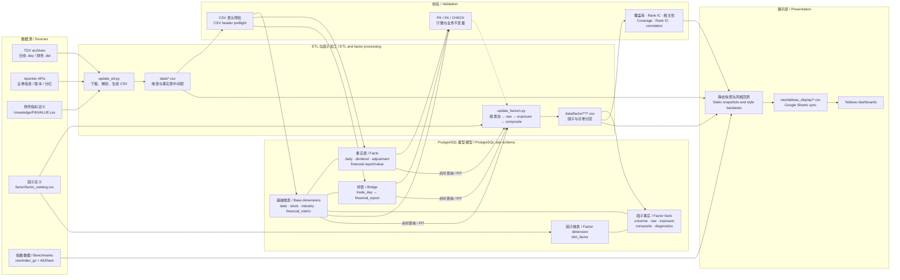

# A 股量化研究流水线 / A-Share Quant Research Pipeline

[中文](#中文) · [English](#english)

本仓库将通达信行情与财务数据加工为 PostgreSQL 星型模型，构建月度因子、诊断与回测结果，并发布 Tableau 可消费的 CSV 和 Google Sheets 数据源。

This repository turns TDX market and financial data into a PostgreSQL star schema, builds monthly factors, diagnostics, and backtests, and publishes Tableau-ready CSV and Google Sheets data sources.

## 架构 / Architecture



PostgreSQL 的核心维表是 `dim_date`、`dim_stock`、`dim_tdx_industry`、`dim_financial_metric` 和 `dim_factor`；行情、分红、复权、财务及因子结果存放在对应事实表中。大体量日期事实表按年分区，`fact_financial_value` 按指标代码哈希分区。基础表字段与关系见 [`knowledge/Schema.md`](knowledge/Schema.md)，因子扩展 DDL 见 [`factor/build_factor_postgres.py`](factor/build_factor_postgres.py)。仓库负责准备数据源并嵌入外部 Tableau Public 视图，不包含 Tableau 工作簿或数据提取文件。

The core PostgreSQL dimensions are `dim_date`, `dim_stock`, `dim_tdx_industry`, `dim_financial_metric`, and `dim_factor`; market, dividend, adjustment, financial, and factor results live in the corresponding fact tables. Large date-based facts are partitioned by year, while `fact_financial_value` is hash-partitioned by metric code. See [`knowledge/Schema.md`](knowledge/Schema.md) for the base schema and [`factor/build_factor_postgres.py`](factor/build_factor_postgres.py) for the factor extension DDL. The repository prepares data sources and embeds external Tableau Public views; it does not contain a Tableau workbook or extract.

<a id="中文"></a>

## 中文

### 目录导览

| 路径 | 用途 |
|---|---|
| [`update_all.ps1`](update_all.ps1) | Windows 全流程入口；固定使用 `.venv\Scripts\python.exe`，七个阶段串行执行，任一阶段失败即停止。 |
| [`update_etl.py`](update_etl.py) | 基础 ETL 编排：raw → CSV → PostgreSQL 重建 → 数据库校验。 |
| [`update_factors.py`](update_factors.py) | 月度股票池、原始因子、因子暴露、风格合成、诊断及 PostgreSQL 因子表装载。 |
| [`build_tableau_display_csv.py`](build_tableau_display_csv.py) | 重建 `raw/tableau_display/` 展示 CSV，并默认同步到 Google Sheets。 |
| [`etl/`](etl/) | TDX 下载与解析、维表/事实表生成、PostgreSQL DDL、装载、校验、路径和日志工具。 |
| [`factor/`](factor/) | 因子目录与配置、计算、预处理、中性化、合成、诊断、组合与风格回测。 |
| `data/` | 生成的基础、因子和回测 CSV；运行时目录，不提交 Git。 |
| `raw/` | 下载的 TDX 文件、指数文件及 Tableau 展示导出；运行时目录，不提交 Git。 |
| `log/` | ETL、因子和失败摘要日志；运行时目录，不提交 Git。 |
| [`docs/`](docs/) | 静态研究展示页及其 JS/CSV 快照。 |
| [`knowledge/`](knowledge/) | 数据模型、ETL 工作流、`FINVALUE` 映射及 TDX/指数参考手册。 |
| [`archived/`](archived/) | 历史与兼容脚本；并非全部停用，`update_all.ps1` 仍调用其中两个脚本。 |
| [`requirements.txt`](requirements.txt) | 已锁定的 Python 依赖；`tqcenter` 需由本地 TdxQuant 环境另行提供。 |

### 运行 `update_all.ps1`

#### 1. 前置条件

- Windows PowerShell，以及项目根目录下的 `.venv` 虚拟环境；当前项目环境与 TdxQuant 手册均推荐 Python 3.13。
- 已安装 [`requirements.txt`](requirements.txt) 中的依赖；`tqcenter` 可导入，且支持 TQ 策略功能的通达信客户端已启动。
- PostgreSQL 已启动，目标数据库已存在，运行用户具备建表、删表和 `COPY` 权限。
- 可以访问 TDX、AkShare 和 Google APIs，并有可用的本地 tqcenter 环境。
- 根目录存在未纳入 Git 的 `google_sheet_service_account.json`，服务账号已获目标 Google Sheets 的编辑权限。
- `raw/index_gz/` 已有基准指数种子 CSV；最终展示层至少使用 `980080_成长100.csv` 和 `000985_中证全指.csv`。

创建虚拟环境并安装公开依赖：

```powershell
py -3.13 -m venv .venv
.\.venv\Scripts\python.exe -m pip install -r .\requirements.txt
```

确认本地 TdxQuant 模块可用：

```powershell
.\.venv\Scripts\python.exe -c "from tqcenter import tq; print('tqcenter OK')"
```

#### 2. 配置 PostgreSQL

在项目根目录创建 `.env`。不要提交真实密码、Token 或服务账号文件。

```dotenv
POSTGRES_HOST=localhost
POSTGRES_PORT=5432
POSTGRES_DB=tdx_quant
POSTGRES_USER=your_user
POSTGRES_PASSWORD=your_password

# 可选：仅用于指数更新失败通知
# TELEGRAM_BOT_TOKEN=your_token
# TELEGRAM_CHAT_ID=your_chat_id
```

`POSTGRES_HOST` 和 `POSTGRES_PORT` 默认分别为 `localhost` 和 `5432`；用户名和密码必填。请显式设置 `POSTGRES_DB`，避免数据库名隐式回退为用户名；默认也会拒绝把 `postgres` 作为目标库。`update_all.ps1` 不创建数据库，如有需要请先手工创建。

#### 3. 执行

在项目根目录运行：

```powershell
.\update_all.ps1
```

如果仅被本机执行策略拦截，可对这一次进程使用：

```powershell
powershell.exe -NoProfile -ExecutionPolicy Bypass -File .\update_all.ps1
```

无需激活虚拟环境；脚本会按自身位置找到项目根目录和 `.venv\Scripts\python.exe`。

> **重要：** 默认运行会下载完整 TDX 数据包、重建大型基础 CSV，并在数据库装载时传入 `--reset` 以删除和重建核心 ETL 表，可能耗时且占用大量磁盘。请确认 `.env` 指向正确的可重建数据库。该入口也会清空并覆盖目标 Google Sheets 的第一个工作表，属于外部写操作。

#### 4. 实际执行顺序

| # | 脚本 | 结果 |
|---:|---|---|
| 1 | `update_etl.py` | 下载/解压 TDX raw，重建基础 CSV，重置并装载 PostgreSQL，随后运行数据库完整性校验。 |
| 2 | `update_factors.py` | 按默认 `201501..latest` 构建全部因子并装载因子表；已有因子月份默认增量跳过，诊断会重算。 |
| 3 | `archived/简历展示页/build_factor_panel_snapshot.py` | 更新 `docs/factor_panel_data.js` 等因子静态快照。 |
| 4 | `archived/update_tableau_csv.py` | 更新已有 `raw/index_gz/*.csv`，并按配置同步指数 Google Sheets。 |
| 5 | `factor/build_portfolio_panel_snapshot.py` | 生成组合回测 CSV 与 `docs/portfolio_panel_data.js`。 |
| 6 | `factor/build_style_group_backtest.py` | 生成风格分组和多空收益 CSV。 |
| 7 | `build_tableau_display_csv.py` | 重建 `raw/tableau_display/` 下的 6 个展示 CSV，并同步 Tableau 使用的 Google Sheets。 |

成功时终端最后显示 `Pipeline completed.`。ETL 与因子阶段的摘要日志写入 `log/etl_*.log` 和 `log/factor_*.log`。

`update_all.ps1` 不接受或转发子脚本参数。它也不是因子历史全量重算入口：若历史基础数据或因子配置发生变化，应单独运行 `update_factors.py --rebuild`，再刷新下游展示。若要跳过数据库、下载或 Google 同步，请直接运行相应 Python 入口并先查看 `--help`；基础 ETL 的参数示例见 [`knowledge/CsvUpdateWorkflow.md`](knowledge/CsvUpdateWorkflow.md)。Google 同步失败会让全流程返回失败，但本地展示 CSV 可能已经成功写出。

### 导出量化研究快照

`scripts/export_quant_snapshot.py` 从当前 PostgreSQL 最终表生成独立、不可变的
Parquet 交付目录。默认行情范围为 2011-01-01 之后首个交易日至源库最新日；
财务包含 2010 年起的报告期、67 个固定指标，并保留公告日以支持 point-in-time 研究。

```powershell
.\.venv\Scripts\python.exe .\scripts\export_quant_snapshot.py
```

默认输出到 `data/deliverables/quant_snapshot_20110101_<YYYYMMDD>_v1/`，包含按年
分区的 `market/`、`financials/`，三个 `dimensions/*.parquet`、`manifest.json`、
`checksums.sha256` 和快照说明。已有同名快照不会被覆盖。使用 `--end-date YYYY-MM-DD`
可固定截止日，使用 `--output-root PATH` 可改变交付根目录。该导出是独立工作流，
不会运行下载、ETL、因子或 Google Sheets 同步。

<a id="english"></a>

## English

### Directory guide

| Path | Purpose |
|---|---|
| [`update_all.ps1`](update_all.ps1) | Windows full-pipeline entry point. It uses `.venv\Scripts\python.exe`, runs seven stages serially, and stops on the first failure. |
| [`update_etl.py`](update_etl.py) | Base orchestration: raw data → CSV → PostgreSQL rebuild → database validation. |
| [`update_factors.py`](update_factors.py) | Monthly universe, raw factors, exposures, style composites, diagnostics, and PostgreSQL factor loading. |
| [`build_tableau_display_csv.py`](build_tableau_display_csv.py) | Rebuilds `raw/tableau_display/` and syncs the display datasets to Google Sheets by default. |
| [`etl/`](etl/) | TDX download/parsing, dimension and fact CSV builders, PostgreSQL DDL/loading/validation, path, and logging helpers. |
| [`factor/`](factor/) | Factor catalog/configuration, calculation, preprocessing, neutralization, composites, diagnostics, portfolio and style backtests. |
| `data/` | Generated base, factor, and backtest CSVs; runtime-only and ignored by Git. |
| `raw/` | Downloaded TDX files, benchmark files, and Tableau display exports; runtime-only and ignored by Git. |
| `log/` | ETL, factor, and failure summary logs; runtime-only and ignored by Git. |
| [`docs/`](docs/) | Static research pages and their generated JS/CSV snapshots. |
| [`knowledge/`](knowledge/) | Data model, ETL workflow, `FINVALUE` mapping, and TDX/index reference manuals. |
| [`archived/`](archived/) | Historical and compatibility scripts. It is not entirely inactive: `update_all.ps1` still calls two scripts here. |
| [`requirements.txt`](requirements.txt) | Pinned Python dependencies. `tqcenter` must be supplied separately by the local TdxQuant environment. |

### Running `update_all.ps1`

#### 1. Prerequisites

- Windows PowerShell and a `.venv` virtual environment in the repository root. Python 3.13 is recommended by both the current project environment and the TdxQuant manual.
- Dependencies from [`requirements.txt`](requirements.txt); an importable `tqcenter` module; and a running TDX client with TQ strategy support.
- A running PostgreSQL instance, an existing target database, and a user allowed to create/drop tables and use `COPY`.
- Access to TDX, AkShare, and Google APIs, plus a working local tqcenter environment.
- An untracked `google_sheet_service_account.json` in the repository root, with edit access to the target Google Sheets.
- Seed benchmark CSVs under `raw/index_gz/`; the final display layer requires at least `980080_成长100.csv` and `000985_中证全指.csv`.

Create the virtual environment and install the public dependencies:

```powershell
py -3.13 -m venv .venv
.\.venv\Scripts\python.exe -m pip install -r .\requirements.txt
```

Verify the locally supplied TdxQuant module:

```powershell
.\.venv\Scripts\python.exe -c "from tqcenter import tq; print('tqcenter OK')"
```

#### 2. Configure PostgreSQL

Create `.env` in the repository root. Never commit real passwords, tokens, or service-account files.

```dotenv
POSTGRES_HOST=localhost
POSTGRES_PORT=5432
POSTGRES_DB=tdx_quant
POSTGRES_USER=your_user
POSTGRES_PASSWORD=your_password

# Optional: used only for index-update failure notifications
# TELEGRAM_BOT_TOKEN=your_token
# TELEGRAM_CHAT_ID=your_chat_id
```

`POSTGRES_HOST` and `POSTGRES_PORT` default to `localhost` and `5432`; the user and password are required. Set `POSTGRES_DB` explicitly so the database name does not implicitly fall back to the user name; the loader also refuses `postgres` as its target by default. `update_all.ps1` does not create the database, so create it first if necessary.

#### 3. Run

From the repository root:

```powershell
.\update_all.ps1
```

If the local execution policy alone blocks the script, bypass it for this process only:

```powershell
powershell.exe -NoProfile -ExecutionPolicy Bypass -File .\update_all.ps1
```

You do not need to activate the virtual environment: the script resolves the repository root and `.venv\Scripts\python.exe` from its own path.

> **Important:** the default run downloads the full TDX archives, rebuilds large base CSVs, and passes `--reset` during database loading, so it can take substantial time and disk space. It drops and rebuilds the core ETL tables; make sure `.env` points to the intended disposable/rebuildable database. This entry point also clears and overwrites the first worksheet in each target Google Sheet.

#### 4. What runs

| # | Script | Result |
|---:|---|---|
| 1 | `update_etl.py` | Downloads/extracts TDX raw data, rebuilds base CSVs, resets and loads PostgreSQL, then runs database integrity validation. |
| 2 | `update_factors.py` | Builds all factors over the default `201501..latest` range and loads the factor tables; completed factor months are skipped incrementally, while diagnostics are recomputed. |
| 3 | `archived/简历展示页/build_factor_panel_snapshot.py` | Refreshes factor snapshots including `docs/factor_panel_data.js`. |
| 4 | `archived/update_tableau_csv.py` | Updates existing `raw/index_gz/*.csv` files and syncs configured benchmark Google Sheets. |
| 5 | `factor/build_portfolio_panel_snapshot.py` | Produces portfolio backtest CSVs and `docs/portfolio_panel_data.js`. |
| 6 | `factor/build_style_group_backtest.py` | Produces style-group and long-short return CSVs. |
| 7 | `build_tableau_display_csv.py` | Rebuilds the six display CSVs under `raw/tableau_display/` and syncs the Google Sheets consumed by Tableau. |

On success, the final terminal message is `Pipeline completed.` ETL and factor summary logs are written to `log/etl_*.log` and `log/factor_*.log`.

`update_all.ps1` does not accept or forward child-script flags. It is not a full historical factor rebuild either: after historical base-data or factor-configuration changes, run `update_factors.py --rebuild` separately and then refresh the downstream presentation outputs. To skip database loading, downloads, or Google synchronization, run the relevant Python entry point directly and inspect its `--help`; see [`knowledge/CsvUpdateWorkflow.md`](knowledge/CsvUpdateWorkflow.md) for base ETL examples. A Google sync failure makes the overall run fail even though the local display CSVs may already have been written successfully.

### Export a quant research snapshot

`scripts/export_quant_snapshot.py` reads the current PostgreSQL final tables and creates an
independent, immutable Parquet delivery directory. By default, market data starts on the first
trading day on or after 2011-01-01 and ends at the source maximum date. Financial data includes
report periods from 2010 onward, a fixed 67-metric whitelist, and announcement dates for
point-in-time research.

```powershell
.\.venv\Scripts\python.exe .\scripts\export_quant_snapshot.py
```

The default destination is `data/deliverables/quant_snapshot_20110101_<YYYYMMDD>_v1/`.
It contains yearly `market/` and `financials/` partitions, three dimension Parquet files,
`manifest.json`, `checksums.sha256`, and snapshot documentation. Existing snapshots are never
overwritten. Use `--end-date YYYY-MM-DD` to pin the cutoff and `--output-root PATH` to select a
different delivery root. This standalone export does not run downloads, ETL, factors, or Google
Sheets synchronization.
