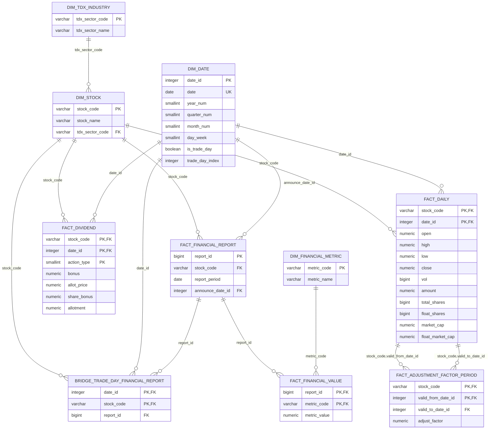

# PostgreSQL 数据库 Schema 草案

## 1. 数据文件与表

| CSV 文件 | PostgreSQL 表 | 记录粒度 |
|---|---|---|
| `dim_tdx_industry.csv` | `dim_tdx_industry` | 每个通达信行业一行 |
| `dim_stock.csv` | `dim_stock` | 每只证券一行 |
| `dim_date.csv` | `dim_date` | 每个自然日一行 |
| `fact_dividend.csv` | `fact_dividend` | 每只证券、日期、公司行为类型一行 |
| `fact_daily.csv` | `fact_daily` | 每只证券、交易日一行 |
| `fact_adjustment_factor_period.csv` | `fact_adjustment_factor_period` | 每只证券、复权因子不变的交易日区间一行 |
| `dim_financial_metric.csv` | `dim_financial_metric` | 每个通达信财务指标一行 |
| `fact_financial_report.csv` | `fact_financial_report` | 每只证券、报告期一行 |
| `fact_financial_value.csv` | `fact_financial_value` | 每份财务报告、每个指标一行 |
| `bridge_trade_day_financial_report.csv` | `bridge_trade_day_financial_report` | 每个交易日、每只证券可见的最新财报 |

当前数据规模：

- `dim_tdx_industry`：127 行
- `dim_stock`：5,531 行
- `dim_date`：13,317 行，范围为 `1989-12-31` 至 `2026-06-16`
- `fact_dividend`：54,475 行
- `fact_daily`：17,535,743 行，范围为 `1990-12-19` 至 `2026-06-12`
- `fact_adjustment_factor_period`：每只证券按复权因子不变区间压缩，行数以重建结果为准
- `dim_financial_metric`：438 行
- `fact_financial_report`：292,867 行
- `fact_financial_value`：128,275,746 行
- `bridge_trade_day_financial_report`：17,775,401 行

PostgreSQL 重建时会对大表启用分区：

- `fact_daily`：按 `date_id` 年度 RANGE 分区。
- `bridge_trade_day_financial_report`：按 `date_id` 年度 RANGE 分区。
- `fact_financial_value`：按 `metric_code` HASH 分区，当前为 16 个分区。

年度分区范围由 `build_postgres_from_csv.py` 根据 `dim_date.csv` 的年份范围
自动创建，并额外创建 default 分区承接超出范围的数据。CSV 仍统一 `COPY`
到父表，由 PostgreSQL 自动路由到子分区。

## 2. 字段口径

### 2.1 `dim_stock`

| 字段 | 类型 | 含义 |
|---|---|---|
| `stock_code` | `VARCHAR(9)` | 带交易所后缀的证券代码，例如 `600000.SH` |
| `stock_name` | `VARCHAR(50)` | 当前证券名称 |
| `tdx_sector_code` | `VARCHAR(6)` | 所属通达信行业代码，关联 `dim_tdx_industry` |

只保留沪深 A 股股票：

```text
6xxxxx.SH
0xxxxx.SZ
30xxxx.SZ
```

数据来源映射：

| CSV 字段 | `tq.get_stock_info` 字段 | PostgreSQL 字段 |
|---|---|---|
| `stock_name` | `Name` | `stock_name` |
| `tdx_sector_code` | `blockzscode` | `tdx_sector_code` |

当前有部分证券无法从接口取得名称或行业代码。CSV 中对应字段留空，导入
PostgreSQL 后应为 `NULL`。这些证券仍可能被事实表引用，因此不能仅因信息
缺失删除对应的 `stock_code`。

### 2.2 `dim_tdx_industry`

| 字段 | 类型 | 含义 |
|---|---|---|
| `tdx_sector_code` | `VARCHAR(6)` | 通达信行业代码 |
| `tdx_sector_name` | `VARCHAR(50)` | 通达信行业名称 |

行业名称来自 `tq.get_stock_info(..., field_list=['rs_hyname','blockzscode'])`。
股票维度只保存行业代码，不重复保存行业名称。

### 2.3 `dim_date`

| 字段 | 类型 | 含义 |
|---|---|---|
| `date_id` | `INTEGER` | `YYYYMMDD` 格式的日期键 |
| `date` | `DATE` | PostgreSQL 标准日期 |
| `year_num` | `SMALLINT` | 年份 |
| `quarter_num` | `SMALLINT` | 季度，范围 1 至 4 |
| `month_num` | `SMALLINT` | 月份，范围 1 至 12 |
| `day_week` | `SMALLINT` | ISO 星期，周一为 1，周日为 7 |
| `is_trade_day` | `BOOLEAN` | 是否存在沪深市场交易 |
| `trade_day_index` | `INTEGER` | 交易日按日期升序排列的序号，首个交易日为 1 |

`dim_date` 是自然日维度。非交易日也需要保留，并将
`is_trade_day` 设置为 `FALSE`。`trade_day_index` 只在
`is_trade_day = TRUE` 时有值，非交易日为 `NULL`。

### 2.4 `fact_dividend`

| 字段 | 类型 | 含义 |
|---|---|---|
| `stock_code` | `VARCHAR(9)` | 证券代码 |
| `date_id` | `INTEGER` | 公司行为日期 |
| `action_type` | `SMALLINT` | `1` 除权除息，`11` 扩缩股，`15` 重新调整 |
| `bonus` | `NUMERIC(18,6)` | 红利 |
| `allot_price` | `NUMERIC(18,6)` | 配股价 |
| `share_bonus` | `NUMERIC(18,6)` | 送股或扩缩股比例 |
| `allotment` | `NUMERIC(18,6)` | 配股比例 |

业务主键为 `(stock_code, date_id, action_type)`，不额外使用代理
`event_id`。

### 2.5 `fact_daily`

| 字段 | 类型 | 含义 |
|---|---|---|
| `date_id` | `INTEGER` | 交易日期 |
| `stock_code` | `VARCHAR(9)` | 证券代码 |
| `open` | `NUMERIC(18,2)` | 不复权开盘价，单位：元 |
| `high` | `NUMERIC(18,2)` | 不复权最高价，单位：元 |
| `low` | `NUMERIC(18,2)` | 不复权最低价，单位：元 |
| `close` | `NUMERIC(18,2)` | 不复权收盘价，单位：元 |
| `vol` | `BIGINT` | 成交量，单位：股 |
| `amount` | `NUMERIC(20,4)` | 成交额，单位：万元 |
| `total_shares` | `BIGINT` | 总股本，单位：股，来自 `tq.get_gb_info` 的 `Zgb`，可空 |
| `float_shares` | `BIGINT` | 流通股本，单位：股，来自 `tq.get_gb_info` 的 `Ltgb`，可空 |
| `market_cap` | `NUMERIC(24,4)` | 总市值，单位：万元，`close * total_shares / 10000`，可空 |
| `float_market_cap` | `NUMERIC(24,4)` | 流通市值，单位：万元，`close * float_shares / 10000`，可空 |

`vol` 必须使用 `BIGINT`。当前数据最大成交量为
`4,173,160,876`，已超过 `INTEGER` 的最大值 `2,147,483,647`。

股本字段来自 `tq.get_gb_info`，按每只股票一次请求覆盖本地 `.day` 中全部
交易日期。市值字段用不复权收盘价和股本统一计算。老股票、退市股票或早期
交易日可能没有有效股本数据；此时四个股本/市值字段同时写为 `NULL`，不影响
OHLC 行入库。

### 2.6 `fact_adjustment_factor_period`

| 字段 | 类型 | 含义 |
|---|---|---|
| `stock_code` | `VARCHAR(9)` | 证券代码 |
| `valid_from_date_id` | `INTEGER` | 该复权因子状态的首个有效交易日 |
| `valid_to_date_id` | `INTEGER` | 该复权因子状态的最后一个有效交易日 |
| `adjust_factor` | `NUMERIC(28,12)` | 后复权因子 |

复权因子只使用本地 `fact_daily` 的不复权收盘价和 `fact_dividend` 的公司行为
计算，不从 tqcenter 获取复权行情。公司行为如果发生在停牌日，因子从该股票
下一个实际交易日生效，前收盘价取生效日前一个交易日的未复权收盘价。

该表不是每日快照表，而是区间有效表。连续交易日内如果后复权因子不变，
只保存一行。后复权价格统一按 `不复权价格 * adjust_factor` 计算。查询
某个交易日的复权因子时，应使用：

```sql
date_id BETWEEN valid_from_date_id AND valid_to_date_id
```

### 2.7 `dim_financial_metric`

| 字段 | 类型 | 含义 |
|---|---|---|
| `metric_code` | `VARCHAR(10)` | 通达信指标代码，例如 `FN40` |
| `metric_name` | `VARCHAR(500)` | `TdxQuant.md` 中对应的完整指标名称和说明 |

`.dat` 文件没有可靠的指标分类、累计属性或独立单位字段，因此 MVP 不保存
`category`、`is_cumulative`、`unit_name` 和额外 `description`。如果名称中
包含“万元”“元”“%”“单季度”等说明，应完整保留在 `metric_name` 中。

### 2.8 `fact_financial_report`

| 字段 | 类型 | 含义 |
|---|---|---|
| `report_id` | `BIGINT` | 由生成脚本分配的财务报告代理主键 |
| `stock_code` | `VARCHAR(9)` | 证券代码 |
| `report_period` | `DATE` | 报告期截止日，对应 `tag_time` 和文件名日期 |
| `announce_date_id` | `INTEGER` | 该证券该报告期的实际公告日期 |

`report_period` 是具有财务语义的期间标识，不关联 `dim_date`。它仍使用
`DATE`，以保证合法日期校验、排序及年份/季度筛选。`announce_date_id`
是真实发生日期，关联 `dim_date(date_id)`。

MVP 不保存修订版本。同一证券、同一报告期只保留一份数据，公告日期是报告
属性。重新导入时覆盖公告日期和指标值。

### 2.9 `fact_financial_value`

| 字段 | 类型 | 含义 |
|---|---|---|
| `report_id` | `BIGINT` | 所属财务报告 |
| `metric_code` | `VARCHAR(10)` | 财务指标代码 |
| `metric_value` | `NUMERIC(28,6)` | `.dat` 中的财务指标值，保留 6 位小数 |

主键为 `(report_id, metric_code)`。当前 `.dat` 数据块没有可靠的缺失值标记，
生成器写入每个有文档定义且为有限数的指标值，包括 `0`。如果以后确认可靠
缺失哨兵值，再在生成阶段过滤。

### 2.10 `bridge_trade_day_financial_report`

| 字段 | 类型 | 含义 |
|---|---|---|
| `date_id` | `INTEGER` | 交易日 |
| `stock_code` | `VARCHAR(9)` | 证券代码 |
| `report_id` | `BIGINT` | 截至该交易日市场可见的最新财报 |

该表是派生桥表，用于把事件型财报公告数据展开成每日可见状态。它只包含
`dim_date.is_trade_day = TRUE` 的交易日。主键 `(date_id, stock_code)` 与
`fact_daily` 的查询粒度一致，方便行情和财务因子直接连接。

## 3. 建表 SQL

```sql
BEGIN;

CREATE TABLE dim_tdx_industry (
    tdx_sector_code VARCHAR(6) PRIMARY KEY,
    tdx_sector_name VARCHAR(50) NOT NULL,

    CONSTRAINT ck_dim_tdx_industry_code
        CHECK (tdx_sector_code ~ '^[0-9]{6}$')
);

CREATE TABLE dim_stock (
    stock_code VARCHAR(9) PRIMARY KEY,
    stock_name VARCHAR(50),
    tdx_sector_code VARCHAR(6),

    CONSTRAINT ck_dim_stock_code
        CHECK (
            stock_code ~ '^(6[0-9]{5}\.SH|0[0-9]{5}\.SZ|30[0-9]{4}\.SZ)$'
        ),
    CONSTRAINT ck_dim_stock_tdx_sector_code
        CHECK (
            tdx_sector_code IS NULL
            OR tdx_sector_code ~ '^[0-9]{6}$'
        ),
    CONSTRAINT fk_dim_stock_tdx_industry
        FOREIGN KEY (tdx_sector_code)
        REFERENCES dim_tdx_industry (tdx_sector_code)
);

CREATE TABLE dim_date (
    date_id       INTEGER PRIMARY KEY,
    date          DATE NOT NULL UNIQUE,
    year_num      SMALLINT NOT NULL,
    quarter_num   SMALLINT NOT NULL,
    month_num     SMALLINT NOT NULL,
    day_week      SMALLINT NOT NULL,
    is_trade_day  BOOLEAN NOT NULL,
    trade_day_index INTEGER,

    CONSTRAINT ck_dim_date_id
        CHECK (date_id = TO_CHAR(date, 'YYYYMMDD')::INTEGER),
    CONSTRAINT ck_dim_date_year
        CHECK (year_num = EXTRACT(YEAR FROM date)::SMALLINT),
    CONSTRAINT ck_dim_date_quarter
        CHECK (
            quarter_num BETWEEN 1 AND 4
            AND quarter_num = EXTRACT(QUARTER FROM date)::SMALLINT
        ),
    CONSTRAINT ck_dim_date_month
        CHECK (
            month_num BETWEEN 1 AND 12
            AND month_num = EXTRACT(MONTH FROM date)::SMALLINT
        ),
    CONSTRAINT ck_dim_date_day_week
        CHECK (
            day_week BETWEEN 1 AND 7
            AND day_week = EXTRACT(ISODOW FROM date)::SMALLINT
        ),
    CONSTRAINT ck_dim_date_trade_day_index
        CHECK (
            (
                is_trade_day = TRUE
                AND trade_day_index IS NOT NULL
                AND trade_day_index > 0
            )
            OR (
                is_trade_day = FALSE
                AND trade_day_index IS NULL
            )
        )
);

CREATE UNIQUE INDEX uq_dim_date_trade_day_index
    ON dim_date (trade_day_index)
    WHERE trade_day_index IS NOT NULL;

CREATE TABLE fact_dividend (
    stock_code   VARCHAR(9) NOT NULL,
    date_id      INTEGER NOT NULL,
    action_type  SMALLINT NOT NULL,
    bonus        NUMERIC(18,6) NOT NULL DEFAULT 0,
    allot_price  NUMERIC(18,6) NOT NULL DEFAULT 0,
    share_bonus  NUMERIC(18,6) NOT NULL DEFAULT 0,
    allotment    NUMERIC(18,6) NOT NULL DEFAULT 0,

    CONSTRAINT pk_fact_dividend
        PRIMARY KEY (stock_code, date_id, action_type),
    CONSTRAINT fk_fact_dividend_stock
        FOREIGN KEY (stock_code)
        REFERENCES dim_stock (stock_code),
    CONSTRAINT fk_fact_dividend_date
        FOREIGN KEY (date_id)
        REFERENCES dim_date (date_id),
    CONSTRAINT ck_fact_dividend_action_type
        CHECK (action_type IN (1, 11, 15)),
    CONSTRAINT ck_fact_dividend_values
        CHECK (
            bonus >= 0
            AND allot_price >= 0
            AND share_bonus >= 0
            AND allotment >= 0
        )
);

CREATE INDEX idx_fact_dividend_date_stock
    ON fact_dividend (date_id, stock_code);

CREATE TABLE fact_daily (
    date_id     INTEGER NOT NULL,
    stock_code  VARCHAR(9) NOT NULL,
    open        NUMERIC(18,2) NOT NULL,
    high        NUMERIC(18,2) NOT NULL,
    low         NUMERIC(18,2) NOT NULL,
    close       NUMERIC(18,2) NOT NULL,
    vol         BIGINT NOT NULL,
    amount      NUMERIC(20,4) NOT NULL,
    total_shares BIGINT,
    float_shares BIGINT,
    market_cap  NUMERIC(24,4),
    float_market_cap NUMERIC(24,4),

    CONSTRAINT pk_fact_daily
        PRIMARY KEY (stock_code, date_id),
    CONSTRAINT fk_fact_daily_stock
        FOREIGN KEY (stock_code)
        REFERENCES dim_stock (stock_code),
    CONSTRAINT fk_fact_daily_date
        FOREIGN KEY (date_id)
        REFERENCES dim_date (date_id),
    CONSTRAINT ck_fact_daily_prices
        CHECK (
            open > 0
            AND high > 0
            AND low > 0
            AND close > 0
            AND high >= GREATEST(open, low, close)
            AND low <= LEAST(open, high, close)
        ),
    CONSTRAINT ck_fact_daily_volume
        CHECK (vol >= 0),
    CONSTRAINT ck_fact_daily_amount
        CHECK (amount >= 0),
    CONSTRAINT ck_fact_daily_capital
        CHECK (
            (
                total_shares IS NULL
                AND float_shares IS NULL
                AND market_cap IS NULL
                AND float_market_cap IS NULL
            )
            OR (
                total_shares > 0
                AND float_shares > 0
                AND float_shares <= total_shares
                AND market_cap > 0
                AND float_market_cap > 0
                AND float_market_cap <= market_cap
            )
        )
) PARTITION BY RANGE (date_id);

CREATE INDEX idx_fact_daily_date_stock
    ON fact_daily (date_id, stock_code);

CREATE TABLE fact_adjustment_factor_period (
    stock_code          VARCHAR(9) NOT NULL,
    valid_from_date_id  INTEGER NOT NULL,
    valid_to_date_id    INTEGER NOT NULL,
    adjust_factor       NUMERIC(28,12) NOT NULL,

    CONSTRAINT pk_fact_adjustment_factor_period
        PRIMARY KEY (stock_code, valid_from_date_id),
    CONSTRAINT fk_adjustment_factor_period_from_daily
        FOREIGN KEY (stock_code, valid_from_date_id)
        REFERENCES fact_daily (stock_code, date_id)
        ON DELETE CASCADE,
    CONSTRAINT fk_adjustment_factor_period_to_daily
        FOREIGN KEY (stock_code, valid_to_date_id)
        REFERENCES fact_daily (stock_code, date_id)
        ON DELETE CASCADE,
    CONSTRAINT ck_adjustment_factor_period_range
        CHECK (valid_from_date_id <= valid_to_date_id),
    CONSTRAINT ck_adjustment_factor_period_positive
        CHECK (adjust_factor > 0)
);

CREATE INDEX idx_adjustment_factor_period_lookup
    ON fact_adjustment_factor_period (
        stock_code,
        valid_from_date_id,
        valid_to_date_id
    );

CREATE INDEX idx_adjustment_factor_period_date_range
    ON fact_adjustment_factor_period (
        valid_from_date_id,
        valid_to_date_id,
        stock_code
    );

CREATE TABLE dim_financial_metric (
    metric_code VARCHAR(10) PRIMARY KEY,
    metric_name VARCHAR(500) NOT NULL,

    CONSTRAINT ck_dim_financial_metric_code
        CHECK (metric_code ~ '^FN[0-9]+$')
);

CREATE TABLE fact_financial_report (
    report_id        BIGINT PRIMARY KEY,
    stock_code       VARCHAR(9) NOT NULL,
    report_period    DATE NOT NULL,
    announce_date_id INTEGER NOT NULL,

    CONSTRAINT ck_fact_financial_report_id
        CHECK (report_id > 0),
    CONSTRAINT uq_fact_financial_report_business
        UNIQUE (stock_code, report_period),
    CONSTRAINT fk_fact_financial_report_stock
        FOREIGN KEY (stock_code)
        REFERENCES dim_stock (stock_code),
    CONSTRAINT fk_fact_financial_report_announce_date
        FOREIGN KEY (announce_date_id)
        REFERENCES dim_date (date_id),
    CONSTRAINT ck_fact_financial_report_period
        CHECK (
            EXTRACT(MONTH FROM report_period) IN (3, 6, 9, 12)
            AND report_period = (
                DATE_TRUNC('month', report_period)
                + INTERVAL '1 month - 1 day'
            )::DATE
        ),
    CONSTRAINT ck_fact_financial_report_announce_date
        CHECK (
            announce_date_id >=
            TO_CHAR(report_period, 'YYYYMMDD')::INTEGER
        )
);

CREATE INDEX idx_fact_financial_report_announce_stock
    ON fact_financial_report (announce_date_id, stock_code);

CREATE TABLE fact_financial_value (
    report_id    BIGINT NOT NULL,
    metric_code  VARCHAR(10) NOT NULL,
    metric_value NUMERIC(28,6) NOT NULL,

    CONSTRAINT pk_fact_financial_value
        PRIMARY KEY (report_id, metric_code),
    CONSTRAINT fk_fact_financial_value_report
        FOREIGN KEY (report_id)
        REFERENCES fact_financial_report (report_id)
        ON DELETE CASCADE,
    CONSTRAINT fk_fact_financial_value_metric
        FOREIGN KEY (metric_code)
        REFERENCES dim_financial_metric (metric_code)
) PARTITION BY HASH (metric_code);

CREATE INDEX idx_fact_financial_value_metric_report
    ON fact_financial_value (metric_code, report_id);

CREATE TABLE bridge_trade_day_financial_report (
    date_id    INTEGER NOT NULL,
    stock_code VARCHAR(9) NOT NULL,
    report_id  BIGINT NOT NULL,

    CONSTRAINT pk_bridge_trade_day_financial_report
        PRIMARY KEY (date_id, stock_code),
    CONSTRAINT fk_bridge_financial_date
        FOREIGN KEY (date_id)
        REFERENCES dim_date (date_id),
    CONSTRAINT fk_bridge_financial_stock
        FOREIGN KEY (stock_code)
        REFERENCES dim_stock (stock_code),
    CONSTRAINT fk_bridge_financial_report
        FOREIGN KEY (report_id)
        REFERENCES fact_financial_report (report_id)
        ON DELETE CASCADE
) PARTITION BY RANGE (date_id);

CREATE INDEX idx_bridge_financial_report
    ON bridge_trade_day_financial_report (report_id);

COMMENT ON COLUMN fact_daily.open IS '不复权开盘价，单位：元';
COMMENT ON COLUMN fact_daily.high IS '不复权最高价，单位：元';
COMMENT ON COLUMN fact_daily.low IS '不复权最低价，单位：元';
COMMENT ON COLUMN fact_daily.close IS '不复权收盘价，单位：元';
COMMENT ON COLUMN fact_daily.vol IS '成交量，单位：股';
COMMENT ON COLUMN fact_daily.amount IS '成交额，单位：万元';
COMMENT ON COLUMN fact_daily.total_shares IS '总股本，单位：股，来自tq.get_gb_info Zgb';
COMMENT ON COLUMN fact_daily.float_shares IS '流通股本，单位：股，来自tq.get_gb_info Ltgb';
COMMENT ON COLUMN fact_daily.market_cap IS '总市值，单位：万元，按收盘价和总股本计算';
COMMENT ON COLUMN fact_daily.float_market_cap IS '流通市值，单位：万元，按收盘价和流通股本计算';
COMMENT ON COLUMN fact_financial_report.report_period
    IS '财务报告期截止日，不关联自然日期维度';
COMMENT ON COLUMN fact_financial_report.announce_date_id
    IS '该证券该报告期的实际公告日期';
COMMENT ON COLUMN fact_financial_value.metric_value
    IS '通达信专业财务数据包中的财务指标值，导入为NUMERIC(28,6)';
COMMENT ON TABLE bridge_trade_day_financial_report
    IS '每个交易日、每只证券截至当日可见的最新财务报告桥表';

COMMIT;
```

## 4. 主键和索引设计

### `fact_daily`

主键采用：

```sql
PRIMARY KEY (stock_code, date_id)
```

它适合最常见的单只证券时间序列查询：

```sql
SELECT *
FROM fact_daily
WHERE stock_code = '600000.SH'
  AND date_id BETWEEN 20250101 AND 20251231
ORDER BY date_id;
```

辅助索引采用：

```sql
CREATE INDEX idx_fact_daily_date_stock
    ON fact_daily (date_id, stock_code);
```

它适合查询某个交易日的全市场截面。

### `fact_dividend`

`(stock_code, date_id, action_type)` 同时表达业务唯一性和增量
UPSERT 冲突键。按日期查询全市场公司行为时使用
`idx_fact_dividend_date_stock`。

### `fact_adjustment_factor_period`

主键采用：

```sql
PRIMARY KEY (stock_code, valid_from_date_id)
```

每行表示一只证券在 `[valid_from_date_id, valid_to_date_id]` 交易日区间内
复权因子不变。区间起点和终点都通过复合外键引用
`fact_daily(stock_code, date_id)`，保证端点是该证券真实存在的日线交易日。

查询某只证券某个交易日的复权因子时使用区间条件：

```sql
SELECT adjust_factor
FROM fact_adjustment_factor_period
WHERE stock_code = '600000.SH'
  AND 20250102 BETWEEN valid_from_date_id AND valid_to_date_id;
```

### `fact_financial_report`

代理主键 `report_id` 用于让数百个指标值通过单列外键引用一份报告。
业务唯一约束为：

```sql
UNIQUE (stock_code, report_period)
```

索引用途：

- 唯一约束 `(stock_code, report_period)` 自带索引，可查询单只证券的历史财报。
- `(announce_date_id, stock_code)`：查询某日公告的全市场财报，以及回测时按
  公告日期过滤。

### `fact_financial_value`

主键 `(report_id, metric_code)` 保证一份报告的一个指标只有一个值。
辅助索引 `(metric_code, report_id)` 用于跨证券、跨报告期查询同一个指标。

### `bridge_trade_day_financial_report`

主键 `(date_id, stock_code)` 与 `fact_daily` 对齐。它缓存以下判断：

```sql
announce_date_id <= 当前交易日
ORDER BY announce_date_id DESC, report_period DESC
LIMIT 1
```

辅助索引 `(report_id)` 用于检查某份财报影响了哪些交易日和证券。

## 5. 导入顺序

必须按照外键依赖顺序导入：

1. `dim_tdx_industry.csv`
2. `dim_stock.csv`
3. `dim_date.csv`
4. `dim_financial_metric.csv`
5. `fact_dividend.csv`
6. `fact_daily.csv`
7. `fact_adjustment_factor_period.csv`
8. `fact_financial_report.csv`
9. `fact_financial_value.csv`
10. `bridge_trade_day_financial_report.csv`

使用 `psql` 客户端的 `\copy` 可以读取客户端本地文件：

```sql
\copy dim_tdx_industry (
    tdx_sector_code,
    tdx_sector_name
) FROM 'C:/Users/87913/Desktop/Gongzuo/dim_tdx_industry.csv'
WITH (FORMAT CSV, HEADER TRUE);

\copy dim_stock (
    stock_code,
    stock_name,
    tdx_sector_code
) FROM 'C:/Users/87913/Desktop/Gongzuo/dim_stock.csv'
WITH (FORMAT CSV, HEADER TRUE);

\copy dim_date (
    date_id,
    date,
    year_num,
    quarter_num,
    month_num,
    day_week,
    is_trade_day,
    trade_day_index
) FROM 'C:/Users/87913/Desktop/Gongzuo/dim_date.csv'
WITH (FORMAT CSV, HEADER TRUE);

\copy fact_dividend (
    stock_code,
    date_id,
    action_type,
    bonus,
    allot_price,
    share_bonus,
    allotment
) FROM 'C:/Users/87913/Desktop/Gongzuo/fact_dividend.csv'
WITH (FORMAT CSV, HEADER TRUE);

\copy fact_daily (
    date_id,
    stock_code,
    open,
    high,
    low,
    close,
    vol,
    amount,
    total_shares,
    float_shares,
    market_cap,
    float_market_cap
) FROM 'C:/Users/87913/Desktop/Gongzuo/fact_daily.csv'
WITH (FORMAT CSV, HEADER TRUE);

\copy fact_adjustment_factor_period (
    stock_code,
    valid_from_date_id,
    valid_to_date_id,
    adjust_factor
) FROM 'C:/Users/87913/Desktop/Gongzuo/fact_adjustment_factor_period.csv'
WITH (FORMAT CSV, HEADER TRUE);

\copy dim_financial_metric (
    metric_code,
    metric_name
) FROM 'C:/Users/87913/Desktop/Gongzuo/dim_financial_metric.csv'
WITH (FORMAT CSV, HEADER TRUE);

\copy fact_financial_report (
    report_id,
    stock_code,
    report_period,
    announce_date_id
) FROM 'C:/Users/87913/Desktop/Gongzuo/fact_financial_report.csv'
WITH (FORMAT CSV, HEADER TRUE);

\copy fact_financial_value (
    report_id,
    metric_code,
    metric_value
) FROM 'C:/Users/87913/Desktop/Gongzuo/fact_financial_value.csv'
WITH (FORMAT CSV, HEADER TRUE);

\copy bridge_trade_day_financial_report (
    date_id,
    stock_code,
    report_id
) FROM 'C:/Users/87913/Desktop/Gongzuo/bridge_trade_day_financial_report.csv'
WITH (FORMAT CSV, HEADER TRUE);
```

`fact_daily.csv` 接近 1 GB，`fact_financial_value.csv` 约 3 GB，均不应
使用逐行 `INSERT`。生产导入时建议先 `COPY` 数据，再创建事实表辅助索引，
以减少索引维护时间。当前财务 CSV 已包含稳定的 `report_id`，所以可以直接
按外键顺序导入，不需要数据库自增或 staging 表。

`bridge_trade_day_financial_report.csv` 是派生结果。全量重建数据库时可以
直接导入；如果后续只增量更新财报，也可以在数据库内按第 7 节逻辑重建。

项目提供 `etl/build_postgres_from_csv.py` 用于从本地 CSV 构建 PostgreSQL
数据库。它从 `.env` 读取认证信息，使用 `psycopg2` 的 `COPY FROM STDIN`
导入客户端本地 CSV，不依赖 `psql` 命令行。

`.env` 建议包含：

```text
POSTGRES_HOST=localhost
POSTGRES_PORT=5432
POSTGRES_DB=tdx_quant
POSTGRES_USER=...
POSTGRES_PASSWORD=...
```

如果没有设置 `POSTGRES_DB`，脚本会退回使用 `POSTGRES_USER` 作为数据库名。
不建议把业务表导入 PostgreSQL 默认维护库 `postgres`。

连接和目标表状态检查：

```powershell
.\.venv\Scripts\python.exe .\etl\build_postgres_from_csv.py --check-only
```

如果不想把数据库名写入 `.env`，可以通过命令行指定。认证仍来自 `.env`：

```powershell
.\.venv\Scripts\python.exe .\etl\build_postgres_from_csv.py --database tdx_quant --check-only
```

首次构建空库：

```powershell
.\.venv\Scripts\python.exe .\etl\build_postgres_from_csv.py
```

如果目标库还不存在，可以创建后再导入：

```powershell
.\.venv\Scripts\python.exe .\etl\build_postgres_from_csv.py --database tdx_quant --create-db
```

如果需要删除已有目标表并全量重建：

```powershell
.\.venv\Scripts\python.exe .\etl\build_postgres_from_csv.py --reset
```

导入后验证：

```powershell
.\.venv\Scripts\python.exe .\etl\build_postgres_from_csv.py --database tdx_quant --validate-only
```

如果数据库已经按旧版 schema 构建过，并且只想迁移 `dim_date` 新增的
`trade_day_index`，推荐执行：

```powershell
.\.venv\Scripts\python.exe .\etl\build_postgres_from_csv.py --database tdx_quant --migrate-dim-date-trade-day-index
```

等价 SQL 如下：

```sql
ALTER TABLE dim_date
    ADD COLUMN IF NOT EXISTS trade_day_index INTEGER;

WITH indexed_trade_days AS (
    SELECT
        date_id,
        ROW_NUMBER() OVER (ORDER BY date_id) AS trade_day_index
    FROM dim_date
    WHERE is_trade_day = TRUE
)
UPDATE dim_date AS d
SET trade_day_index = i.trade_day_index
FROM indexed_trade_days AS i
WHERE d.date_id = i.date_id;

UPDATE dim_date
SET trade_day_index = NULL
WHERE is_trade_day = FALSE;

ALTER TABLE dim_date
    DROP CONSTRAINT IF EXISTS ck_dim_date_trade_day_index;

ALTER TABLE dim_date
    ADD CONSTRAINT ck_dim_date_trade_day_index
        CHECK (
            (
                is_trade_day = TRUE
                AND trade_day_index IS NOT NULL
                AND trade_day_index > 0
            )
            OR (
                is_trade_day = FALSE
                AND trade_day_index IS NULL
            )
        );

CREATE UNIQUE INDEX IF NOT EXISTS uq_dim_date_trade_day_index
    ON dim_date (trade_day_index)
    WHERE trade_day_index IS NOT NULL;
```

## 6. 导入后校验

```sql
SELECT COUNT(*) FROM dim_stock;
-- 预期：5531

SELECT COUNT(*) FROM dim_tdx_industry;
-- 预期：127

SELECT COUNT(*)
FROM dim_stock
WHERE stock_name IS NULL
  AND tdx_sector_code IS NULL;
-- 预期：324

SELECT COUNT(*) FROM dim_date;
-- 预期：13317

SELECT CASE
    WHEN MIN(trade_day_index) = 1
     AND MAX(trade_day_index) = COUNT(*)
     AND COUNT(DISTINCT trade_day_index) = COUNT(*)
    THEN 0
    ELSE 1
END AS trade_day_index_error
FROM dim_date
WHERE is_trade_day = TRUE;
-- 预期：0

SELECT COUNT(*) FROM fact_dividend;
-- 预期：54475

SELECT COUNT(*) FROM fact_daily;
-- 预期：17535743

SELECT COUNT(*) FROM fact_adjustment_factor_period;
-- 预期：显著小于 fact_daily，具体值以重建结果为准

SELECT COUNT(*) FROM dim_financial_metric;
-- 预期：438

SELECT COUNT(*) FROM fact_financial_report;
-- 预期：292867

SELECT COUNT(*) FROM fact_financial_value;
-- 预期：128275746

SELECT COUNT(*) FROM bridge_trade_day_financial_report;
-- 预期：17775401

SELECT COUNT(*)
FROM fact_daily AS f
JOIN dim_date AS d USING (date_id)
WHERE d.is_trade_day = FALSE;
-- 预期：0

SELECT COUNT(*)
FROM fact_daily AS d
WHERE NOT EXISTS (
    SELECT 1
    FROM fact_adjustment_factor_period AS a
    WHERE a.stock_code = d.stock_code
      AND d.date_id BETWEEN a.valid_from_date_id AND a.valid_to_date_id
);
-- 预期：0

SELECT COUNT(*)
FROM (
    SELECT
        stock_code,
        valid_from_date_id,
        LAG(valid_to_date_id) OVER (
            PARTITION BY stock_code
            ORDER BY valid_from_date_id, valid_to_date_id
        ) AS previous_valid_to_date_id
    FROM fact_adjustment_factor_period
) AS ranges
WHERE previous_valid_to_date_id IS NOT NULL
  AND valid_from_date_id <= previous_valid_to_date_id;
-- 预期：0

SELECT COUNT(*)
FROM fact_adjustment_factor_period
WHERE adjust_factor <= 0;
-- 预期：0

SELECT stock_code, date_id, COUNT(*)
FROM fact_daily
GROUP BY stock_code, date_id
HAVING COUNT(*) > 1;
-- 预期：0 行

SELECT stock_code, date_id, action_type, COUNT(*)
FROM fact_dividend
GROUP BY stock_code, date_id, action_type
HAVING COUNT(*) > 1;
-- 预期：0 行

SELECT COUNT(*)
FROM bridge_trade_day_financial_report AS b
JOIN dim_date AS d USING (date_id)
WHERE d.is_trade_day = FALSE;
-- 预期：0

SELECT COUNT(*)
FROM bridge_trade_day_financial_report AS b
JOIN fact_financial_report AS r USING (report_id)
WHERE r.announce_date_id > b.date_id;
-- 预期：0
```

构建财务 CSV 时，不在 `dim_stock` 中的原始证券代码会被跳过，数量和少量
样例写入 summary log。跳过这些记录是为了保持外键完整性。

## 7. 增量写入建议

日线数据使用以下冲突键：

```sql
ON CONFLICT (stock_code, date_id) DO UPDATE
SET open = EXCLUDED.open,
    high = EXCLUDED.high,
    low = EXCLUDED.low,
    close = EXCLUDED.close,
    vol = EXCLUDED.vol,
    amount = EXCLUDED.amount,
    total_shares = EXCLUDED.total_shares,
    float_shares = EXCLUDED.float_shares,
    market_cap = EXCLUDED.market_cap,
    float_market_cap = EXCLUDED.float_market_cap;
```

公司行为使用以下冲突键：

```sql
ON CONFLICT (stock_code, date_id, action_type) DO UPDATE
SET bonus = EXCLUDED.bonus,
    allot_price = EXCLUDED.allot_price,
    share_bonus = EXCLUDED.share_bonus,
    allotment = EXCLUDED.allotment;
```

数据库表中的行没有固有顺序。所有查询都应通过 `ORDER BY` 明确指定
日期升序或倒序，不应依赖 CSV 导入顺序。

桥表通常全量重建或按受影响日期区间重建。全量重建方式：

```sql
TRUNCATE bridge_trade_day_financial_report;

INSERT INTO bridge_trade_day_financial_report (
    date_id,
    stock_code,
    report_id
)
SELECT
    d.date_id,
    s.stock_code,
    r.report_id
FROM dim_date AS d
JOIN dim_stock AS s
    ON TRUE
JOIN LATERAL (
    SELECT fr.report_id
    FROM fact_financial_report AS fr
    WHERE fr.stock_code = s.stock_code
      AND fr.announce_date_id <= d.date_id
    ORDER BY
        fr.announce_date_id DESC,
        fr.report_period DESC
    LIMIT 1
) AS r
    ON TRUE
WHERE d.is_trade_day = TRUE;
```

如果公告日当天数据可能在收盘后才可见，可将条件改为：

```sql
fr.announce_date_id < d.date_id
```

这会从公告日后的下一个交易日开始使用财务数据，更保守。

## 8. 财务数据详细设计

### 8.1 日期语义

财务数据包含两个不同含义的日期：

| 来源 | 数据库字段 | 含义 |
|---|---|---|
| 文件名 `gpcw20251231.dat` 或接口 `tag_time` | `report_period` | 财务报告覆盖的截止日期 |
| 接口 `announce_time` 或股票数据块中的公告日期 | `announce_date_id` | 该股票实际向市场披露数据的日期 |

`report_period` 使用 `DATE`，但不关联 `dim_date`。它是财务期间属性，
不要求对应一个已发生的自然日维度记录。

`announce_date_id` 关联 `dim_date(date_id)`。它用于判断某个交易日之前
市场能够看到哪些财务信息。

文件名日期只能用于设置和校验 `report_period`，不能作为包内所有证券的
`announce_date_id`。

### 8.2 表粒度

#### `dim_financial_metric`

每个通达信 `FN` 指标一行：

```text
FN40  -> 资产总计
FN230 -> 营业收入
FN312 -> 营业总收入(单季度)(万元)
```

指标名称来自 `TdxQuant.md` 的专业财务字段表。MVP 不从名称中推断单位、
财务报表分类或累计属性。

#### `fact_financial_report`

每只证券、每个报告期一行：

```text
stock_code + report_period
```

例如：

```text
600519.SH + 2025-03-31 + 20250430
```

`announce_date_id` 是该报告的属性。`report_id` 是生成脚本分配的代理
主键，供指标值表和桥表引用。MVP 不保存修订版本；同一报告期重新导入时
覆盖公告日期和指标值。如果以后需要保留更正前后的多个版本，再增加修订
字段或独立版本表。

#### `fact_financial_value`

一份财务报告的一个财务指标一行：

```text
report_id + metric_code
```

采用长表是因为指标数量多，宽表会非常稀疏且难以扩展。当前 `.dat` 数据块
没有可靠的缺失值标记，生成器写入每个有文档定义且为有限数的指标值，真实
零值和可能的空缺零值都保留为 `0`。

#### `bridge_trade_day_financial_report`

每个交易日、每只证券一行：

```text
date_id + stock_code
```

它保存该交易日市场已经可见的最新财报 `report_id`。例如某股票在
`2026-03-21` 公告 2025 年年报，在 `2026-04-30` 公告 2026 年一季报，
桥表会在两个公告日之间把该股票映射到 2025 年年报；一季报公告后再映射
到 2026 年一季报。

桥表不是新的事实来源，而是从 `fact_financial_report` 派生出来的查询加速
表。它可以随时删除后重建。

### 8.3 数据加载流程

1. 从 `TdxQuant.md` 提取有效的 `FN` 代码和完整名称，加载
   `dim_financial_metric`。
2. 遍历有效的 `gpcwYYYYMMDD.dat` 文件。
3. 将文件名日期解析为 `report_period`。
4. 从股票索引映射为带市场后缀的 `stock_code`，并校验其存在于
   `dim_stock`。
5. 从每只股票的数据块获取实际公告日期，转换为 `announce_date_id`。
6. 确保公告日期存在于 `dim_date`；如超出当前范围，先扩展自然日维度。
7. 生成稳定的 `report_id`，写入 `fact_financial_report`。
8. 将有文档定义且为有限数的财务指标写入 `fact_financial_value`。
9. 不导入只有文件头、没有有效股票记录的占位 `.dat` 文件。
10. 基于 `fact_financial_report` 重建
    `bridge_trade_day_financial_report`。

财务报告 UPSERT：

```sql
INSERT INTO fact_financial_report (
    report_id,
    stock_code,
    report_period,
    announce_date_id
)
VALUES (
    123456,
    '600519.SH',
    DATE '2025-03-31',
    20250430
)
ON CONFLICT (
    stock_code,
    report_period
) DO UPDATE
SET announce_date_id = EXCLUDED.announce_date_id
RETURNING report_id;
```

该语句既能幂等地保留或取得 `report_id`，也能在源数据修正后更新公告日期。
增量导入时，指标值应使用 `RETURNING` 得到的实际 `report_id`；全量 CSV
重建时，直接使用生成脚本写入 CSV 的 `report_id`。

指标值 UPSERT：

```sql
INSERT INTO fact_financial_value (
    report_id,
    metric_code,
    metric_value
)
VALUES (
    1,
    'FN40',
    272082000000.0
)
ON CONFLICT (report_id, metric_code) DO UPDATE
SET metric_value = EXCLUDED.metric_value;
```

### 8.4 查询与回测语义

按报告期查询：

```sql
SELECT
    r.stock_code,
    r.report_period,
    r.announce_date_id,
    v.metric_code,
    v.metric_value
FROM fact_financial_report AS r
JOIN fact_financial_value AS v USING (report_id)
WHERE r.stock_code = '600519.SH'
  AND r.report_period = DATE '2025-03-31';
```

回测时必须按公告日期限制可见数据，不能只按报告期：

```sql
SELECT DISTINCT ON (r.stock_code, v.metric_code)
    r.stock_code,
    r.report_period,
    r.announce_date_id,
    v.metric_code,
    v.metric_value
FROM fact_financial_report AS r
JOIN fact_financial_value AS v USING (report_id)
WHERE r.announce_date_id <= 20250506
ORDER BY
    r.stock_code,
    v.metric_code,
    r.announce_date_id DESC,
    r.report_period DESC;
```

如果数据源只有公告日期而没有公告时间，为防止未来数据泄漏，日内或开盘策略
应从公告日后的下一个交易日开始使用该财务数据。

使用桥表查询某交易日的财务因子：

```sql
SELECT
    d.date_id,
    d.stock_code,
    d.close,
    r.report_period,
    r.announce_date_id,
    v.metric_code,
    v.metric_value
FROM fact_daily AS d
JOIN bridge_trade_day_financial_report AS b
    ON b.date_id = d.date_id
   AND b.stock_code = d.stock_code
JOIN fact_financial_report AS r
    ON r.report_id = b.report_id
JOIN fact_financial_value AS v
    ON v.report_id = b.report_id
WHERE d.date_id = 20260506
  AND v.metric_code = 'FN232';
```

这避免每次查询都重复执行“截至当前交易日最新公告财报”的窗口选择。

### 8.5 财务数据校验

```sql
-- 报告期只允许季度末或年末
SELECT *
FROM fact_financial_report
WHERE EXTRACT(MONTH FROM report_period) NOT IN (3, 6, 9, 12)
   OR report_period <> (
       DATE_TRUNC('month', report_period)
       + INTERVAL '1 month - 1 day'
   )::DATE;
-- 预期：0 行

-- 公告日期不能早于报告期
SELECT *
FROM fact_financial_report
WHERE announce_date_id <
      TO_CHAR(report_period, 'YYYYMMDD')::INTEGER;
-- 预期：0 行

-- 不允许同一报告中出现重复指标
SELECT report_id, metric_code, COUNT(*)
FROM fact_financial_value
GROUP BY report_id, metric_code
HAVING COUNT(*) > 1;
-- 预期：0 行

-- 指标值必须能找到指标定义
SELECT COUNT(*)
FROM fact_financial_value AS v
LEFT JOIN dim_financial_metric AS m USING (metric_code)
WHERE m.metric_code IS NULL;
-- 预期：0
```

## 9. 完整数据库 ERD

`fact_financial_report.report_period` 不连接 `dim_date`，这是有意设计：
它是报告期间属性，不是自然日事实外键。


